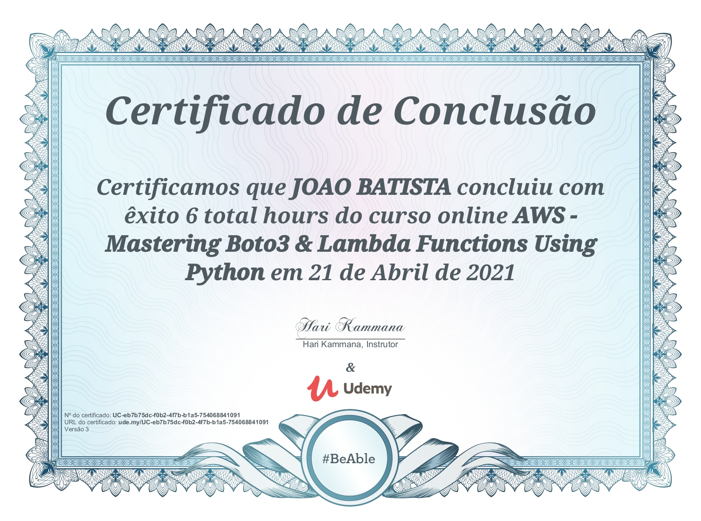

# aws-lambda-with-boto3
AWS Lambda is a serverless compute service that lets you run code without provisioning or managing servers, creating workload-aware cluster scaling logic, maintaining event integrations, or managing runtimes.

Boto3
At its core, all that Boto3 does is call AWS APIs on your behalf. For the majority of the AWS services, Boto3 offers two distinct ways of accessing these abstracted APIs:

  1 - Client: low-level service access
  2 - Resource: higher-level object-oriented service access You can use either to interact with S3.

To connect to the low-level client interface, you must use Boto3’s client(). You then pass in the name of the service you want to connect to, in this case, s3:

  import boto3
  s3_client = boto3.client('s3')

To connect to the high-level interface, you’ll follow a similar approach, but use resource():

  import boto3
  s3_resource = boto3.resource('s3')  

    
